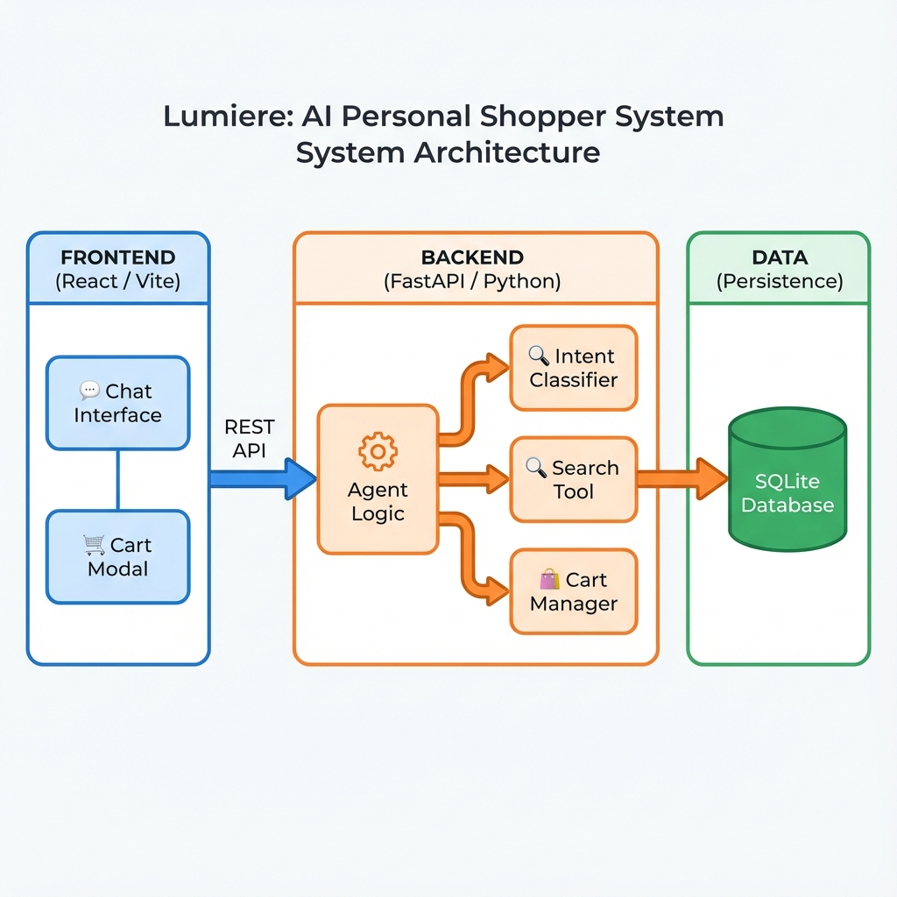

# Lumière - The AI Personal Shopper
> *The AI that knows your style better than you do.*


**Lumière** is an intelligent, context-aware personal shopper agent designed to revolutionize e-commerce. Unlike traditional filters, Lumière understands natural language, style context (e.g., "winter wedding"), and manages your shopping experience from discovery to checkout.

---


## 🏗️ System Architecture



## ✨ Key Features

- **🧠 Context-Aware Intelligence**: Understands "Add the silver one" after showing multiple items.
- **🔍 Smart Search**: Maps vague terms like "Summer Wedding" to specific categories (Formal + Summer).
- **🛍️ Seamless Cart Management**:
    - Add items via Chat ("Add this to my bag") or UI Buttons.
    - View and Remove items directly from a dedicated Cart Modal.
- **💾 Persistence**: Chat history and cart state functionality.
- **🎨 Premium UI**: A "Lookbook" style interface built with **React** and **TailwindCSS**.

## 🛠️ Tech Stack

- **Frontend**: React, TypeScript, TailwindCSS, Vite, Lucide Icons.
- **Backend**: FastAPI, Python 3.11+, Pydantic.
- **AI/Logic**: **Groq** (Ultra-fast Inference) + **Meta Llama 3** (LLM).
- **Database**: SQLite.

## 🚀 Quick Start for Judges

### 1. Backend Setup
```bash
cd backend
python -m venv venv
source venv/bin/activate  # or venv\Scripts\activate on Windows
pip install -r requirements.txt

# Initialize Database
python seed.py

# Run Server
uvicorn main:app --reload
```
*Server runs on `http://localhost:8000`*

### 2. Frontend Setup
```bash
cd frontend
npm install
npm run dev
```
*App runs on `http://localhost:5173`*

---

## 🧪 Try These Scenarios

1.  **Contextual Search**: "I need an outfit for a chilly outdoor wedding."
2.  **Smart Add**: "Show me silver tuxedos" -> "Add the first one to my cart."
3.  **Correction**: "Actually, I need sunglasses instead."
4.  **Cart Management**: Click the **Cart Icon** to view or remove items.
